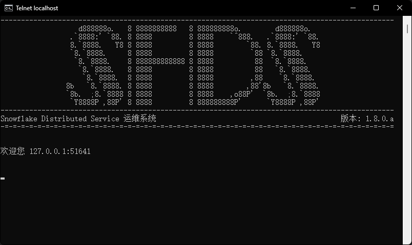
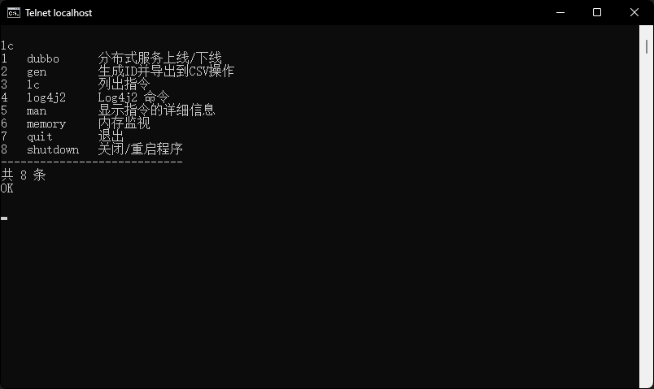

# snowflake-distributed-service - SnowFlake分布式服务

SnowFlake分布式服务是一个轻量级的全局ID分发服务，全局ID的生成算法使用了SnowFlake算法。

该服务可以提供大量的全局唯一的ID，ID的大小基于时间，新生成的ID要大于旧的ID，这保证了ID作为主键在数据库存储时的时间有效性。

该服务使用 dubbo rpc 分布式框架搭建，可以轻松地进行伸缩，部署新服务时仅仅需要改变配置即可。

## 项目的主要模块

| 模块名称     | 模块路径                                   | 说明                    |
|:---------|:---------------------------------------|:----------------------|
| **node** | **snowflake-distributed-service-node** | **可部署的服务节点**          |
| **api**  | **snowflake-distributed-service-api**  | **可以通过引入该模块快速的调用此服务** |
| stack    | snowflake-distributed-service-stack    | 接口定义                  |
| impl     | snowflake-distributed-service-impl     | 项目实现                  |
| sdk      | snowflake-distributed-service-sdk      | 开发工具                  |

## 文档

该项目的文档位于 [docs](../../../docs) 目录下，包括：

### wiki

wiki 为项目的开发人员为本项目编写的详细文档，包含不同语言的版本，主要入口为：

1. [简介](./Introduction.md) - 即本文件。
2. [目录](./Contents.md) - 文档目录。

## 服务的使用

1. 下载该项目，推荐使用SSH。

   ```
   git clone [本项目名称]
   ```

2. 使用maven安装该项目的依赖项目。

   该项目引用同作者的其它项目，如 dutil，不过这些项目并不在中心仓库中，如果提示找不到这些引用，
   请在 github 或者 gitee 查找同作者的项目，并使用以下指令。

   ```
   mvn clean install
   ```

   该项目同作者的依赖项目：

   (全球) [[github] dutil-作者大学时代开始编写的Java实用工具集合](https://github.com/DwArFeng/dutil)

   (中国) [[gitee]  dutil-作者大学时代开始编写的Java实用工具集合](https://gitee.com/DwArFeng/dutil)

3. 使用 maven 安装本项目(为了 api 能够使用，请安装，而不是打包)。

   ```shell script
   mvn clean install
   ```

4. 解压文件。

   找到 `snowflake-distributed-service-node`
   目录下的 `target/snowflake-distributed-service-node-alpha-[项目版本]-release.tar.gz` 并解压。
    ```shell script
    tar -zxcf snowflake-distributed-service-node-[项目版本]-release.tar.gz
    ```

5. 修改配置文件。

   `conf/dubbo/connection.properties`
   ```
   # Zookeeper地址
   dubbo.zookeeper.address=zookeeper://192.168.XXX.XXX:2181
   # dubbo 提供者端口
   dubbo.port=20000
   # dubbo 提供者qos端口
   dubbo.qos.port=21000
   # dubbo 提供者主机名称
   dubbo.host=192.168.154.1
   ```

   `conf/snowflake/device.properties`
   ```
   # Worker ID，最大为31，新的节点序列号向下递减，最少到0。
   snowflake.workder_id=31
   # Datacenter ID，最大为31，新的节点序列号向下递减，最少到0。
   snowflake.datacenter_id=31
   ```

6. 启动。
   ```shell script
   cd [项目所在目录]
   sh ./bin/snowflake-start.sh
   ```

7. Enjoy it!

## 服务的调用

所有服务的调用参照 `snowflake-distributed-service-api` 项目。

- 通过 rpc 进行调用。

  `src/test/java/com/dwarfeng/sfds/rpc/impl/LongIdServiceImplTest.java`

   ```java
   @RunWith(SpringJUnit4ClassRunner.class)
   @ContextConfiguration(locations = "classpath:spring/application-context*.xml")
   public class LongIdServiceImplTest {
   
     @Autowired
     private LongIdService longIdService;
   
     @Test
     public void nextLongId() throws ServiceException {
         for (int i = 0; i < 100; i++) {
             CT.trace(longIdService.nextLongId());
         }
     }
   
     @Test
     public void nextLongIdKey() throws ServiceException {
         for (int i = 0; i < 100; i++) {
             CT.trace(longIdService.nextLongIdKey());
         }
     }
   
     @Test
     public void nextLongIdSize() throws ServiceException {
         List<Long> longs = longIdService.nextLongId(100);
         longs.forEach(CT::trace);
     }
   
     @Test
     public void nextLongIdKeySize() throws ServiceException {
         List<LongIdKey> longIdKeys = longIdService.nextLongIdKey(100);
         longIdKeys.forEach(CT::trace);
     }
   }
   ```

- 与 subgrade 集成

  subgrade 是作者的全项目通用工具类，提供了基于Spring框架的大量快捷的开发工具，本项目与其集成，
  提供了 `SnowflakeLongGenerator`。

  `com.dwarfeng.sfds.api.integration.subgrade.SnowflakeLongIdKeyGeneratorTest`

  ```java
  @RunWith(SpringJUnit4ClassRunner.class)
  @ContextConfiguration(locations = "classpath:spring/application-context*.xml")
  public class SnowflakeLongIdKeyGeneratorTest {
  
      @Autowired
      private SnowflakeLongIdKeyGenerator generator;
  
      @Test
      public void testGenerate() throws GenerateException {
          for (int i = 0; i < 100; i++) {
              CT.trace(generator.generate());
          }
      }
  
      @Test
      public void testBatchGenerate() throws GenerateException {
          List<LongIdKey> longIdKeys = generator.batchGenerate(100);
          longIdKeys.forEach(CT::trace);
      }
  }
  ```

## 运行截图

Telnet 运维平台 banner：



Telnet 运维平台指令合集：


